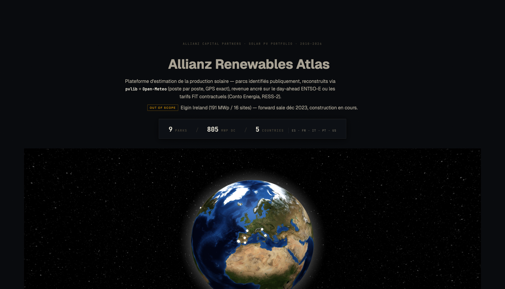
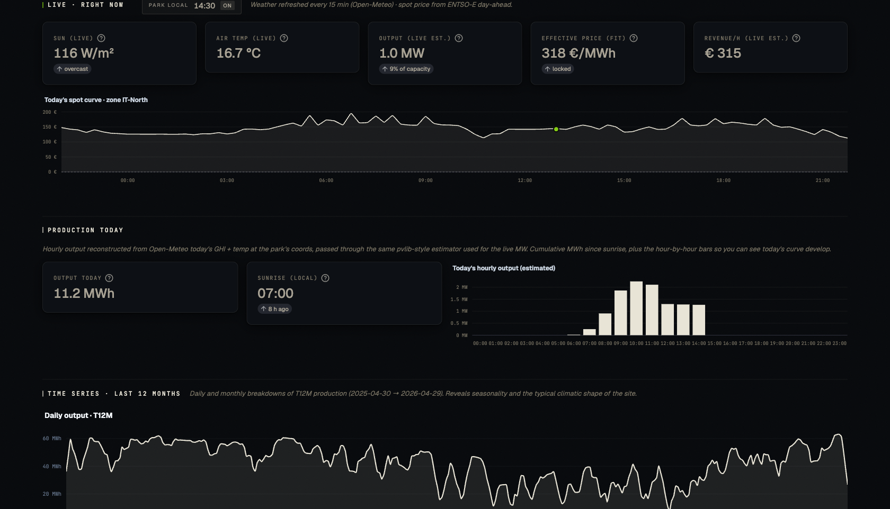
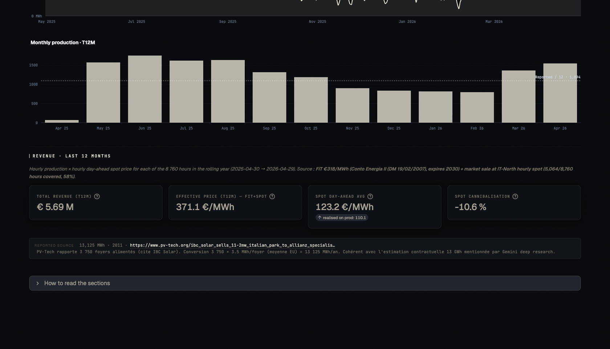
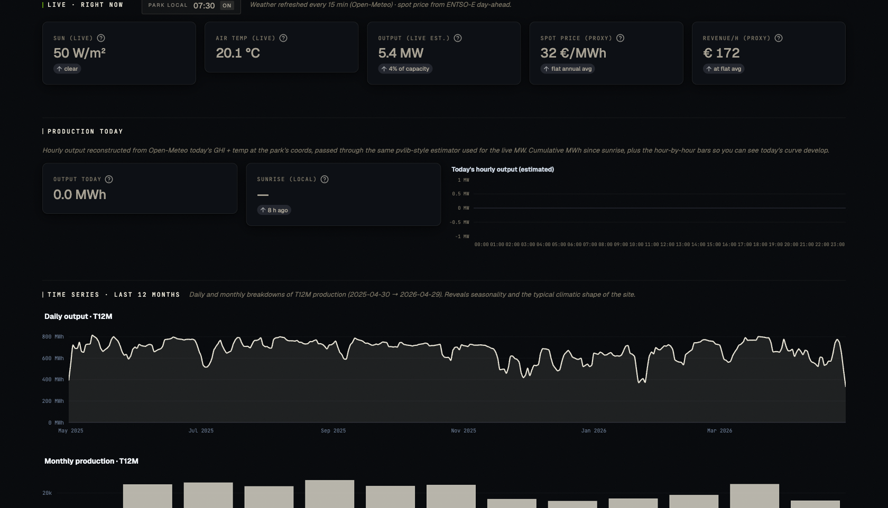

# Allianz Renewables Atlas

> Plateforme d'estimation de la production solaire des parcs photovoltaïques détenus par
> Allianz Capital Partners et identifiés publiquement (2010-2026). Reconstruction
> hour-by-hour via `pvlib` + Open-Meteo Archive aux coordonnées exactes de chaque parc,
> revenue ancré sur les prix day-ahead ENTSO-E ou les tarifs FiT contractuels.

**9 parcs · 805 MWp · 5 pays** (IT, PT, FR, US, ES). Sources : 100 % publiques.



## Périmètre

| # | Parc | Pays | Capacité | Régime de revenu |
|---|---|---|---|---|
| 1 | Manzano | IT (Friuli) | 11.2 MWp | Conto Energia II + market sale |
| 2 | SiSen Foggia | IT (Pouilles) | 8 MWp | Conto Energia III + market sale |
| 3 | Ourika | PT (Alentejo) | 46 MWp | Subsidy-free PPA Audax |
| 4 | Solara 4 / Riccardo Totta | PT (Algarve) | 219 MWp | PPA Audax 20 ans |
| 5 | Lacs Médocains AREF II | FR (Gironde) | 9.4 MWp | Marché libre |
| 6 | Lotus Solar Farm | US-CA | 67 MWp | PPA Southern California Edison |
| 7 | Galloway 2 | US-TX | 147 MWp | PPA EDF Energy Services |
| 8 | Tabernas | ES (Andalousie) | 250 MWp | Marché libre |
| 9 | José Cabrera | ES (Castilla-La Mancha) | 47 MWp | Marché libre |

**Out of scope** : Elgin Ireland Portfolio (191 MWp / 16 sites) — forward sale signée déc 2023,
panneaux pas encore tous construits ni raccordés au réseau.

## Captures

### Live · right now (Manzano, IT)
Production live estimée + prix spot day-ahead temps réel + revenue/h, avec heure locale du parc
en évidence. La courbe spot du jour est tracée hour-by-hour avec curseur sur l'heure courante.



### Revenue · last 12 months (Manzano sous Conto Energia)
Pour les parcs italiens sous Conto Energia (>1 MW), revenu = FiT contractuel
(€318/MWh garanti par l'État, contrat 20 ans) + vente énergie sur marché spot horaire
(€110/MWh réalisé, post-cannibalisation).



### Live US (Galloway 2, Texas)
Pour les parcs hors zone ENTSO-E (US), prix wholesale via fallback flat (ERCOT West $35/MWh,
CAISO SP15 $62/MWh). Heure locale du parc affichée — ici 07:30 Texas alors que l'utilisateur
se connecte depuis l'Europe à 14:30.



## Stack technique

- **Frontend** : Streamlit avec custom component `globe_picker` (globe.gl + Three.js, NASA Blue Marble)
- **Production** : `pvlib` (POA Hay-Davies, Sandia cell temp, PVWatts DC, inverter clipping
  DC/AC=1.30, 14% losses), météo via Open-Meteo Archive (ECMWF reanalysis)
- **Prix électricité** : `energy-charts.info` (mirror ENTSO-E day-ahead, hourly + 15-min depuis oct 2025)
- **Italian Conto Energia** : tarifs CE II/III + Spalma-Incentivi 2014 (-8 % pour P > 900 kW)
  appliqués manuellement (GSE Atlaimpianti requiert credentials)
- **Cartes** : Esri World Imagery (satellite), Leaflet
- **Components custom** : `coord_picker` (dblclick → save GPS override)

## Lancer en local

```bash
git clone https://github.com/Manceff/allianz-renewables-atlas.git
cd allianz-renewables-atlas
python3 -m venv .venv && source .venv/bin/activate
pip install -r requirements.txt
streamlit run src/app.py
```

L'app se lance sur `http://localhost:8501`. Aucun secret nécessaire — toutes les APIs sont publiques
(Open-Meteo, energy-charts.info, Esri tile server).

## Architecture des données

```
data/
├── parks_index.yaml          # Master config 9 parcs + sub-sites + FiT rates
├── coord_overrides.yaml      # GPS corrections user-curated par parc
├── reported_production.yaml  # MWh annuels publiés par opérateurs (cross-check)
├── electricity_prices/       # Cache local prix horaires par zone × année (regen on demand)
└── production_pvlib/         # Cache local pvlib reconstruction (regen on demand)
```

```
src/
├── app.py                    # Page Streamlit unique (header → globe → detail panel)
├── lib/
│   ├── parks_loader.py       # Pydantic schema + YAML loader (cached)
│   ├── solar_model.py        # pvlib pipeline (compute_period_production, ...)
│   ├── electricity_prices.py # energy-charts API + hour-bucket resampling + fallbacks
│   ├── live_weather.py       # Open-Meteo current + today-hourly
│   └── portfolio_model.py    # Multi-site aggregate pvlib (forward-sale code path)
├── components/
│   ├── globe_picker/         # 3D globe with click → park selection
│   └── coord_picker/         # Esri map with dblclick → save coords
└── assets/
    └── style.css             # Bone editorial palette, mono numerics, tinted off-black
```

## Méthodologie

Voir le panneau "How to read the sections" en bas de chaque page parc (expander Streamlit) pour
le détail de chaque section et de ses sources.

## Disclaimer

Ce projet est une démarche personnelle en post-entretien pour montrer la qualité de raisonnement
quantitatif sur le périmètre Renewables d'Allianz. Aucune donnée propriétaire d'Allianz Capital
Partners n'est utilisée. Toutes les sources sont citées dans le YAML d'index ou les press releases
linkées dans le panneau détail de chaque parc.
